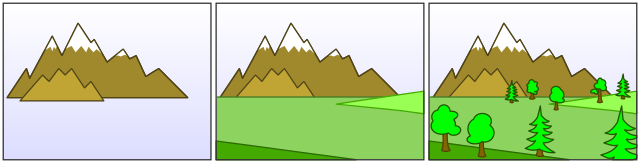

# Perlin

Perlin (named from a [bird](https://en.wikipedia.org/wiki/Perlin_(falconry))) is a lightweight 2D graphics engine for .NET Core using [Veldrid](https://veldrid.dev/). It's well documented, has a simple architecture and is meant to be more as a base code for your engine than something that does everything out-of-the-box.

Currently its working on Windows, OSX, Linux, in the near future I plan to get it work on Android and iOS.

## Features

- Uses the display tree concept (see below) to render your scene.
- Simple text rendering included.
- Mouse and keyboard handling code included.
- Can display parts of image regions as a simple texture atlas support.
- Desktop window management via SDL2.
- Thanks to Veldrid it automatically chooses the ideal rendering backend for your PC (Vulkan/Metal/OpenGL/DirectX..)
- Loads images via [ImageSharp](https://github.com/SixLabors/ImageSharp), so common formats (jpg, png, bmp, gif) are supported.

## The display tree



Perlin puts the objects to render in a display tree similar to other rendering engines (HTML DOM, Android's GUI, Microsoft's WPF,..). The root of the display tree (called `Stage`) has children, these can also have children and so on creating a tree data structure. Every object in the display tree is a subclass of DisplayObject, here lie the common properties, like `Width`, `Height`, `Rotation`,... Transformations in the display tree are cumulative, e.g. if you set the transparency/rotation/position/scale of an object its every descendant (child, grandchild,..) will be affected as well.

The Z-order (what is rendered in front of what) is determined based on the position of the display tree. An object will be always behind its children; the order between the children is that the first child will be in the back and the last one in the front.

## Getting started

A simple Hello world code that will show a rotating rectangle and a textfield:

```c#
using Perlin;
using Perlin.Display;
using SixLabors.Fonts;
using SixLabors.ImageSharp;
using SixLabors.ImageSharp.PixelFormats;

namespace Hello
{
    public class HelloWorld
    {
        public static void Main()
        {
            new HelloWorld();
        }
        
        public HelloWorld()
        {
            PerlinApp.Start(400, 300, "Hello Perlin!", OnInit);
        }

        private void OnInit()
        {
            PerlinApp.Stage.BackgroundColor = new Rgb24(200, 200, 200);
            
            var textField = new TextField(PerlinApp.FontRobotoMono.CreateFont(18));
            textField.Text = "Hello world!";
            textField.BackgroundColor = Color.Coral;
            textField.FontColor = Color.White;
            textField.X = 150;
            textField.Y = 100;
            PerlinApp.Stage.AddChild(textField);
            
            var sp = new Sprite(40, 40, Color.Gold);
            sp.X = 50;
            sp.Y = 50;
            // the EnterFrameEvent fires in each frame
            sp.EnterFrameEvent += (target, secs) => sp.Rotation++;
            PerlinApp.Stage.AddChild(sp);
        }
    }
}
```

## License

Copyright 2020- Matyas Forian Szabo and code contributors

Licensed under the Apache License, Version 2.0 (the "License");
you may not use files in this project except in compliance with the License.
You may obtain a copy of the License at

    http://www.apache.org/licenses/LICENSE-2.0

Unless required by applicable law or agreed to in writing, software
distributed under the License is distributed on an "AS IS" BASIS,
WITHOUT WARRANTIES OR CONDITIONS OF ANY KIND, either express or implied.
See the License for the specific language governing permissions and
limitations under the License.
